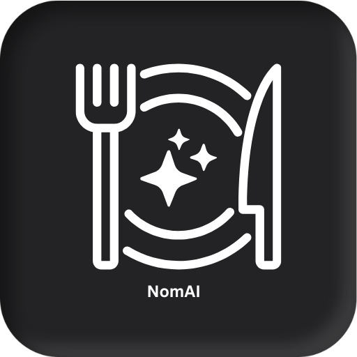
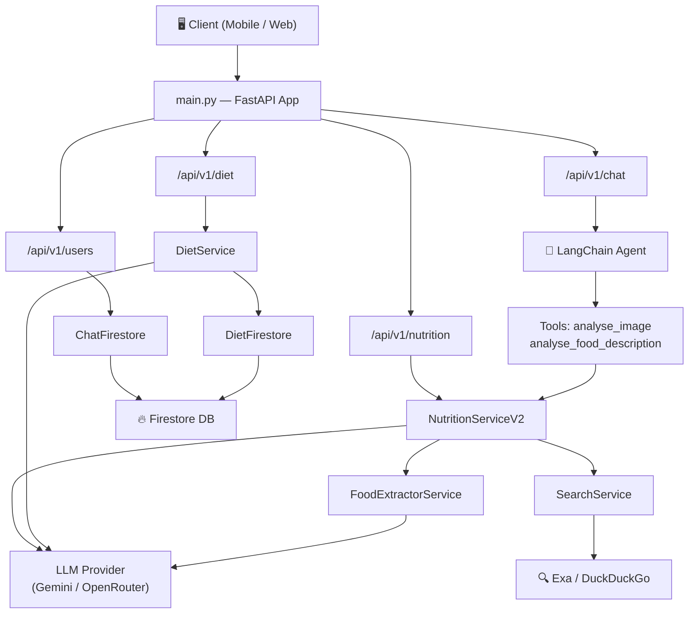
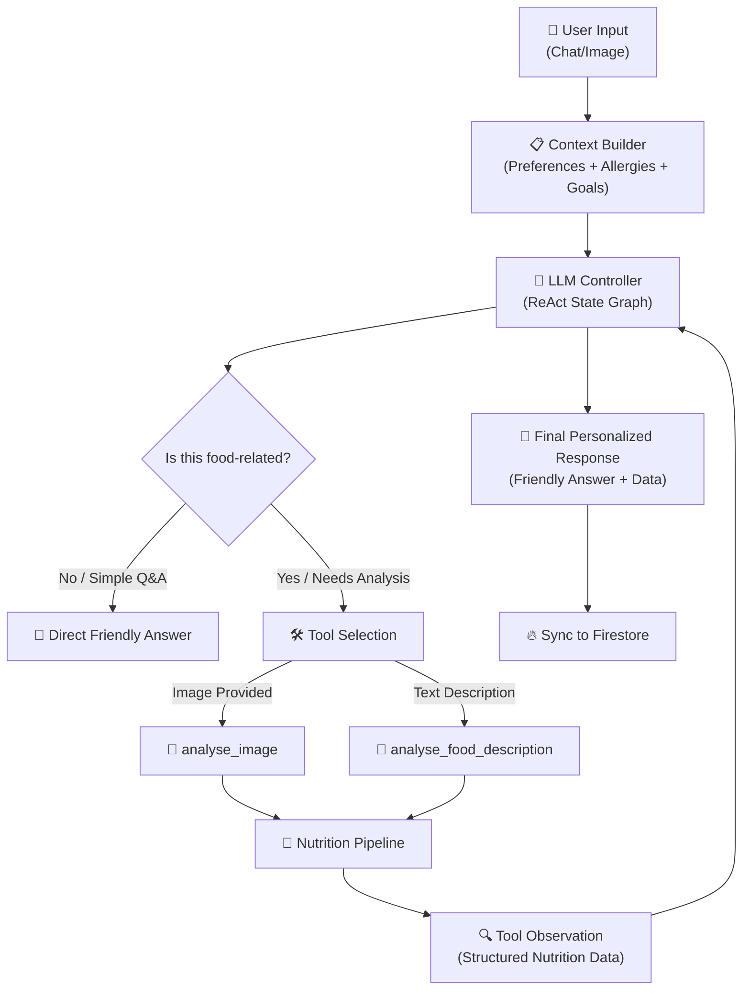
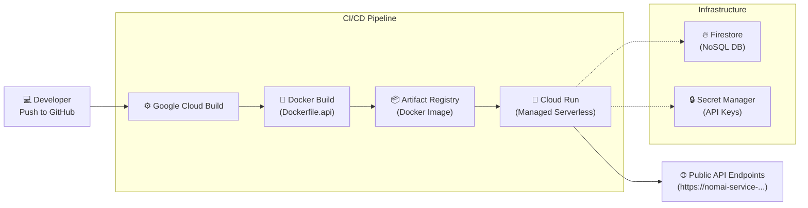
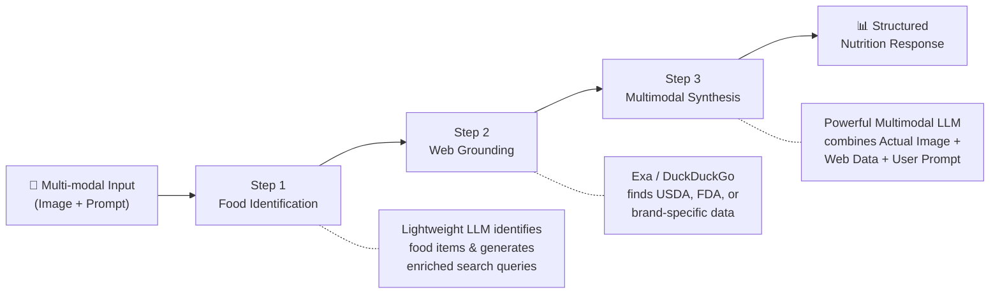
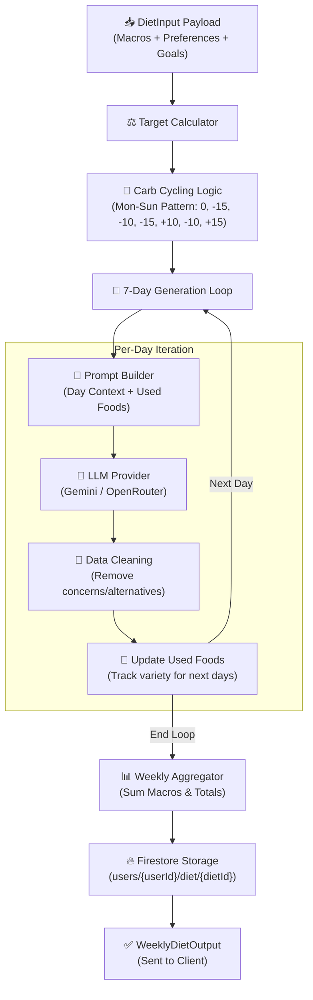
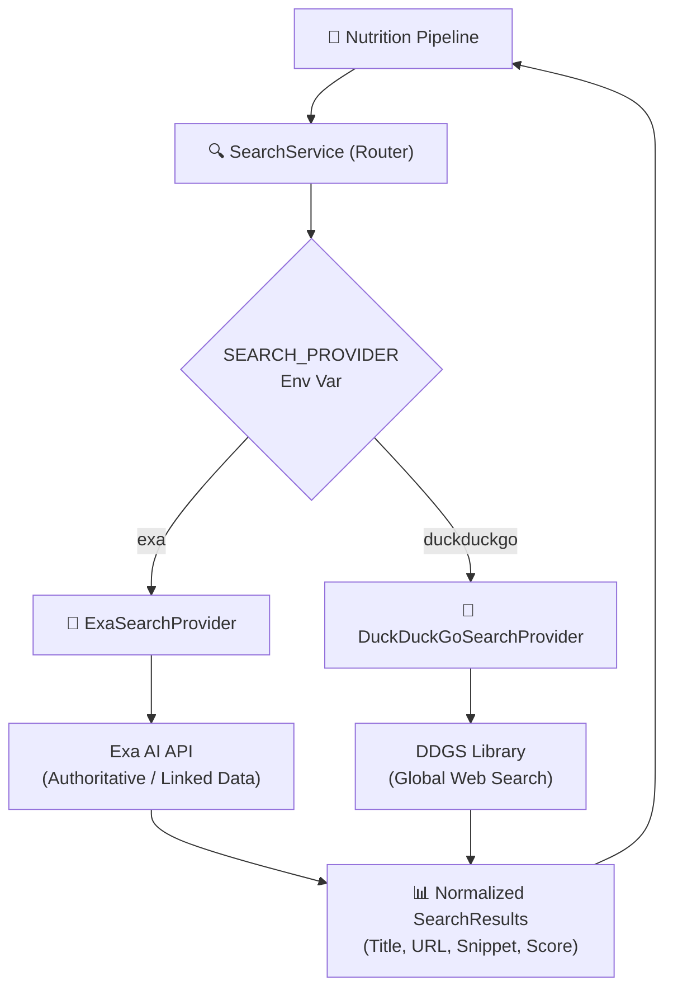
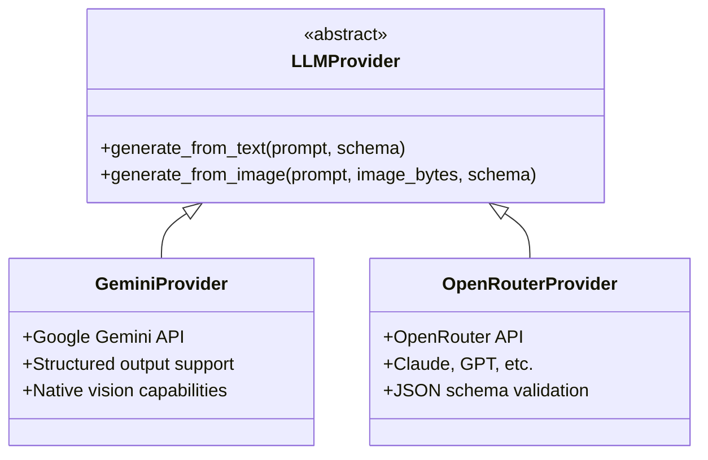
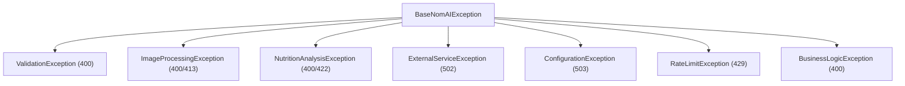

<div align="center">
  

# **NomAI**

### 🧠 AI-Powered Nutrition Intelligence Platform

Analyze food, chat with AI, plan weekly diets, and receive real-time nutrition insights.

**📱 Mobile App:** [Download / View Repository](https://github.com/MabudAlam/NomAI-App)

[](https://fastapi.tiangolo.com/)
[](https://python.org)
[](https://ai.google.dev/)
[](https://firebase.google.com/)
[](https://exa.ai/)
[](https://duckduckgo.com/)
[](https://railway.com/deploy/ACNcz0?referralCode=jEIluR&utm_medium=integration&utm_source=template&utm_campaign=generic)

</div>

---

## ⚡ Overview

NomAI is a powerful AI Agent that brings nutrition and food intelligence to life. Whether you're analyzing meals through images, chatting with an AI nutrition assistant, or generating personalized weekly diet plans — NomAI handles the heavy lifting with a sophisticated multi-step LLM pipeline backed by real-time web research.

---

## ✨ Features

| Feature | Description |
|---------|-------------|
| 🧠 **AI Nutrition Analysis** | Analyze food from images or text descriptions with a 3-step pipeline: food extraction → web search → LLM synthesis |
| 💬 **Conversational AI Chatbot** | LangChain-powered agent that understands dietary preferences, allergies, and health goals |
| 🍽️ **Weekly Diet Planner** | Generate 7-day personalized meal plans with carb cycling, variety tracking, and macro targets |
| 🔄 **Meal Alternatives** | Get 5 AI-suggested alternative meals respecting your dietary profile |
| 📊 **Nutrition Tracking** | Mark meals as eaten, update plans on the fly, and track diet history |
| 🔗 **Dual LLM Support** | Seamlessly switch between Google Gemini and OpenRouter (Claude) providers |
| 🌐 **Web-Grounded Analysis** | Nutrition data enriched with web search results from Exa or DuckDuckGo |
| 🛢️ **Firestore Persistence** | Chat history and diet plans stored in Google Firestore |

[](https://railway.com/deploy/ACNcz0?referralCode=jEIluR&utm_medium=integration&utm_source=template&utm_campaign=generic)

---

## 🏗️ Architecture



---

## 🔌 API Endpoints

### 🥗 Nutrition — `/api/v1/nutrition`

| Method | Path | Description |
|--------|------|-------------|
| `POST` | `/analyze` | Analyze nutrition from a food **image** (URL required) |
| `POST` | `/analyze-by-description` | Analyze nutrition from a **text description** |

### 🤖 AI Agent Chat — `/api/v1/chat`

| Method | Path | Description |
|--------|------|-------------|
| `POST` | `/messages` | Send a message and receive AI nutrition analysis with tool calls |

### 💬 Chat History — `/api/v1/users`

| Method | Path | Description |
|--------|------|-------------|
| `GET` | `/` | Get chat messages for a user (paginated) |
| `PATCH` | `/log-status` | Update the `isAddedToLogs` flag for a message |

### 🍽️ Diet Plans — `/api/v1/diet`

| Method | Path | Description |
|--------|------|-------------|
| `POST` | `/` | Generate a new weekly diet plan |
| `GET` | `/{user_id}` | Get the active weekly diet |
| `GET` | `/{user_id}/history` | Get diet history (paginated) |
| `POST` | `/{user_id}/suggest-alternatives` | Suggest 5 alternative meals |
| `PUT` | `/{user_id}/{day_index}/meals/{meal_type}` | Update a specific meal |
| `PATCH` | `/{user_id}/meals/eaten` | Mark a meal as eaten / not eaten |
| `GET` | `/{user_id}/diet/{diet_id}` | Get a specific diet by ID |
| `POST` | `/{user_id}/diet/{diet_id}/copy` | Copy a past diet as new active diet |

---

## 🧠 AI Agent Decision Flow

NomAI's conversational brain operates as a **ReAct Agent** (Reasoning + Acting). It doesn't just respond; it thinks, selects tools, and iterates until it has the best answer.



### The State Graph (ReAct Pattern)
NomAI maintains a **Message State** that evolves during a single request:
1.  **State Init**: User message + System prompt (Personalized Profile).
2.  **Reasoning**: The LLM analyzes the intent. If it sees food, it pauses and emits a `tool_call`.
3.  **Acting**: The system executes the `analyse_image` or `analyse_food_description` tool.
4.  **Observation**: The tool's output (nutrients, calories, fiber) is appended to the message list.
5.  **Finalization**: The LLM reads the tool's findings and crafts a warm, personalized message (e.g., *"This burger looks delicious, Pavel! It has 650 calories, but keep an eye on the sodium..."*).

---

## 🚀 Deployment

NomAI supports **two easy deployment options**: **Google Cloud Platform (GCP)** or **Railway**.

### ☁️ Option 1: GCP (Cloud Run)

NomAI is architected for the cloud, utilizing a fully automated CI/CD pipeline on **Google Cloud Platform (GCP)**.



### 🚂 Option 2: Railway (One-Click Template)

One-click deployment to Railway with built-in environment variable management and template setup.

[](https://railway.com/deploy/ACNcz0?referralCode=jEIluR&utm_medium=integration&utm_source=template&utm_campaign=generic)

#### 🚂 One-Click Railway Template Deployment

1. **Click the button above** — This opens Railway with the NomAI template pre-loaded
2. **Connect your GitHub** repository to enable automatic deployments
3. **Configure Environment Variables** in the Railway dashboard:

| Variable | Description | Required |
|----------|-------------|----------|
| `FIREBASE_CREDENTIALS_JSON` | Full Firebase service account JSON string | ⬜|
| `GOOGLE_API_KEY` | Google Gemini API key (If openrouter is used then can skip this ) | ✅ |
| `EXA_API_KEY` | Exa search API key (optional if not using DuckDuckGo) | ⬜ |
| `SEARCH_PROVIDER` | `exa` or `duckduckgo` |✅ |
| `PROVIDER_TYPE` | `gemini` or `openrouter` | ✅ |
| `GEMINI_MODEL` | Gemini model name (auto-switches when `PROVIDER_TYPE=gemini`) | ⬜ |
| `OPENROUTER_MODEL` | OpenRouter model name (auto-switches when `PROVIDER_TYPE=openrouter`) | ⬜ |
| `OPENROUTER_API_KEY` | OpenRouter API key (if using openrouter) | ⬜ |
| `AGENT_MODEL` | Agent model for LangChain if provider is gemini then put gemini model else openrouter model (default: `openai/gpt-4o-mini`) |✅ |

> **Model Auto-Switching**: When `PROVIDER_TYPE=gemini`, the system uses `GEMINI_MODEL` (default: `gemini-2.0-flash`). When `PROVIDER_TYPE=openrouter`, it uses `OPENROUTER_MODEL` (default: `google/gemini-3.1-flash-lite-preview`).


The Firebase Credentials are loaded 3 ways , on the local machine via direct service.json file , on the GCP it does n't require service.json file , on non Google provider like railway , we load the service.json file via key FIREBASE_CREDENTIALS_JSON. 

4. **Deploy** — Railway auto-detects Python, installs dependencies via `uv`, and starts `uvicorn main:app`
5. **Custom Domain** (optional) — Add a custom domain in Railway service settings

#### Railway Features
- ✅ Automatic HTTPS/SSL
- ✅ GitHub integration for auto-deploy on push
- ✅ Environment variable management
- ✅ Built-in logs and monitoring
- ✅ Free tier available

### Production Stack
-   **Containerization**: `uv`-optimized Python 3.13 slim image for fast builds and minimal footprint.
-   **Orchestration**: Managed via `cloudbuild.yaml` in `infra/cloudbuild/` (GCP).
-   **Hosting**: **Google Cloud Run** for autoscaling serverless execution (GCP) or **Railway** for managed deployment.
-   **Registry**: **Google Artifact Registry** for secure container storage (GCP).

---

NomAI uses a sophisticated **3-step pipeline** for accurate, web-grounded nutrition analysis:



| Step | Purpose | Service |
|------|---------|---------|
| **1. Food Identification** | Lightweight LLM detects food items and generates enriched queries for search | `FoodExtractorService` |
| **2. Web Grounding** | Executes targeted searches (Exa/DDG) to find authoritative nutritional facts | `SearchService` |
| **3. Multimodal Synthesis** | Final LLM combines **Actual Image** + **Web Results** + **User Prompt** for the result | `GeminiProvider` / `OpenRouterProvider` |
| **4. Client Delivery** | Returns highly accurate, fact-checked structured data to the user | `FastAPI Response` |

---

## 📅 Diet Plan Generation Flow

Generating a weekly diet plan is a multi-stage process that balances nutritional targets, metabolic variety (carb cycling), and food diversity.



### Key Stages
1.  **Payload Intake**: Receives targets (Calories, P/C/F), dietary restrictions (Vegan, Keto, etc.), and health goals.
2.  **Carb Cycling Pattern**: Instead of flat targets, the system applies a pattern (e.g., lower carbs on Mon/Thu, higher carbs on Fri/Sun) to prevent metabolic adaptation.
3.  **Sequential Variety Loop**: The system generates one day at a time, feeding the list of `used_foods` from previous days back into the next prompt to ensure you don't eat the same thing every day.
4.  **Final Aggregation**: Calculates the total weekly impact and persists the plan as "active" in Firestore.

---

## 🌍 Web Grounding Infrastructure
NomAI utilizes a modular search architecture to ground AI responses in real-world data. It supports multiple search backends that can be toggled via environment variables.



---

## 🤖 LLM Provider Strategy

NomAI supports multiple LLM backends via a strategy pattern:



Switch providers with a single environment variable: `PROVIDER_TYPE=gemini` or `PROVIDER_TYPE=openrouter`.

---

## 📂 Project Structure

```
nomai-backend/
├── app/
│   ├── agent/                  # LangChain AI agent
│   ├── config/                 # App settings
│   ├── endpoints/              # API route handlers
│   ├── exceptions/             # Custom exception hierarchy
│   ├── middleware/             # FastAPI middleware
│   ├── models/                 # Pydantic data models
│   ├── services/               # Business logic layer
│   └── utils/                  # Helpers and shared utilities
├── infra/                      # Infrastructure as Code
│   ├── cloudbuild/             # GCP Cloud Build configs
│   └── docker/                 # Dockerfile.api
├── main.py                     # App entrypoint
├── pyproject.toml              # Dependencies (uv)
└── railway.json                # Railway deployment config
```

---

## ⚠️ Error Handling

NomAI uses a comprehensive exception hierarchy with 18 standardized error codes:



---

## 🚀 Getting Started

### 1. Clone the Repository
```bash
git clone https://github.com/Pavel401/nomai-backend.git
cd nomai-backend
```

### 2. Install Dependencies
```bash
uv sync
```

### 3. Run the Server
```bash
uvicorn main:app --host 0.0.0.0 --port 8000 --reload
```

---

## 🔧 Environment Variables

| Variable | Purpose | Default |
|----------|---------|---------|
| `PROD` | Production mode toggle | `false` |
| `PROVIDER_TYPE` | LLM provider (`gemini` / `openrouter`) | `gemini` |
| `GOOGLE_API_KEY` | Google Gemini API key | — |
| `GEMINI_MODEL` | Gemini model name (auto-used when `PROVIDER_TYPE=gemini`) | `gemini-2.0-flash` |
| `OPENROUTER_API_KEY` | OpenRouter API key | — |
| `OPENROUTER_MODEL` | OpenRouter model (auto-used when `PROVIDER_TYPE=openrouter`) | `google/gemini-3.1-flash-lite-preview` |
| `AGENT_MODEL` | Agent model for LangChain | `openai/gpt-4o-mini` |
| `SEARCH_PROVIDER` | Search backend (`exa` / `duckduckgo`) | `exa` |
| `EXA_API_KEY` | Exa search API key | — |
| `FIREBASE_CREDENTIALS_PATH` | Firebase service account JSON path | — |
| `FIREBASE_CREDENTIALS_JSON` | Firebase service account JSON string (for Railway) | — |
| `FIRESTORE_DATABASE_ID` | Firestore database ID | `mealai` |
| `DEBUG_MODE` | Enable pipeline debug logging | `false` |
| `HOST` / `PORT` | Server bind address | `0.0.0.0` / `8000` |

---

## 👨‍💻 Tech Stack

| Tech | Use Case |
|------|----------|
| **FastAPI** | API framework |
| **LangChain** | Agent orchestration & tool management |
| **Google Gemini** | Primary LLM for analysis & generation |
| **OpenRouter** | Alternative LLM provider (Claude, GPT, etc.) |
| **Pydantic v2** | Data validation & structured output |
| **Firestore** | Chat & diet plan persistence |
| **Exa / DuckDuckGo** | Web search for nutrition data grounding |
| **Python 3.13+** | Core backend language |
| **uv** | Package management |

---

<div align="center">

**Built with ❤️**

</div>
